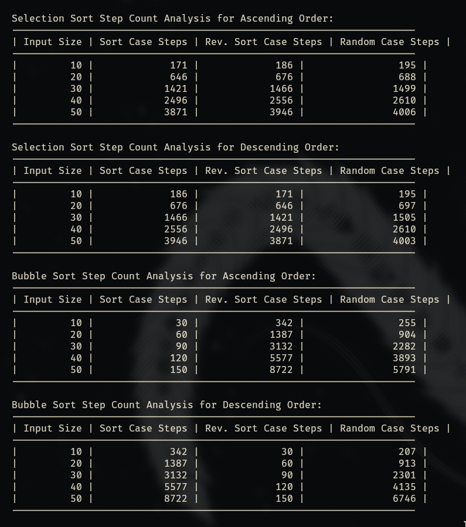
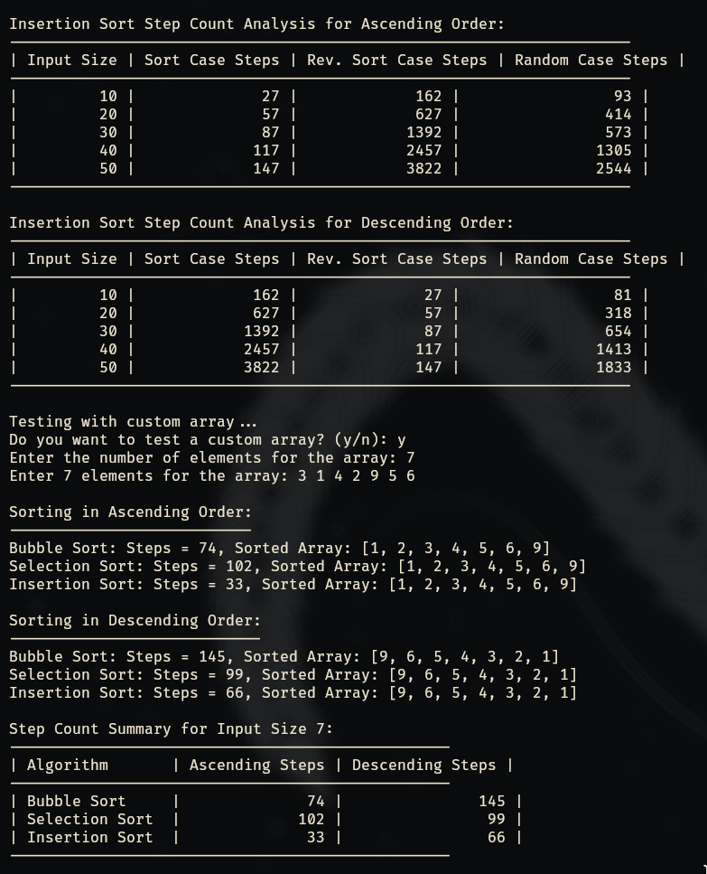
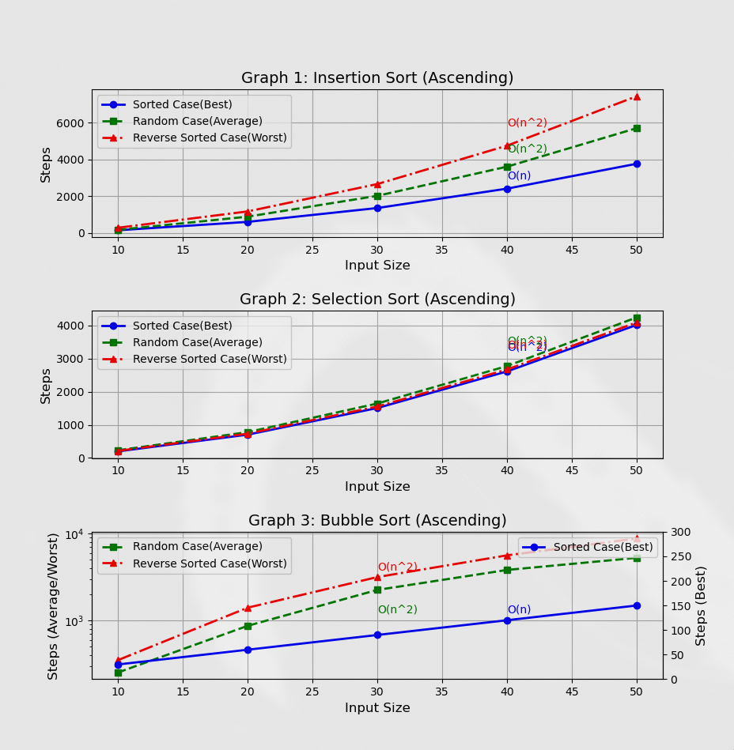
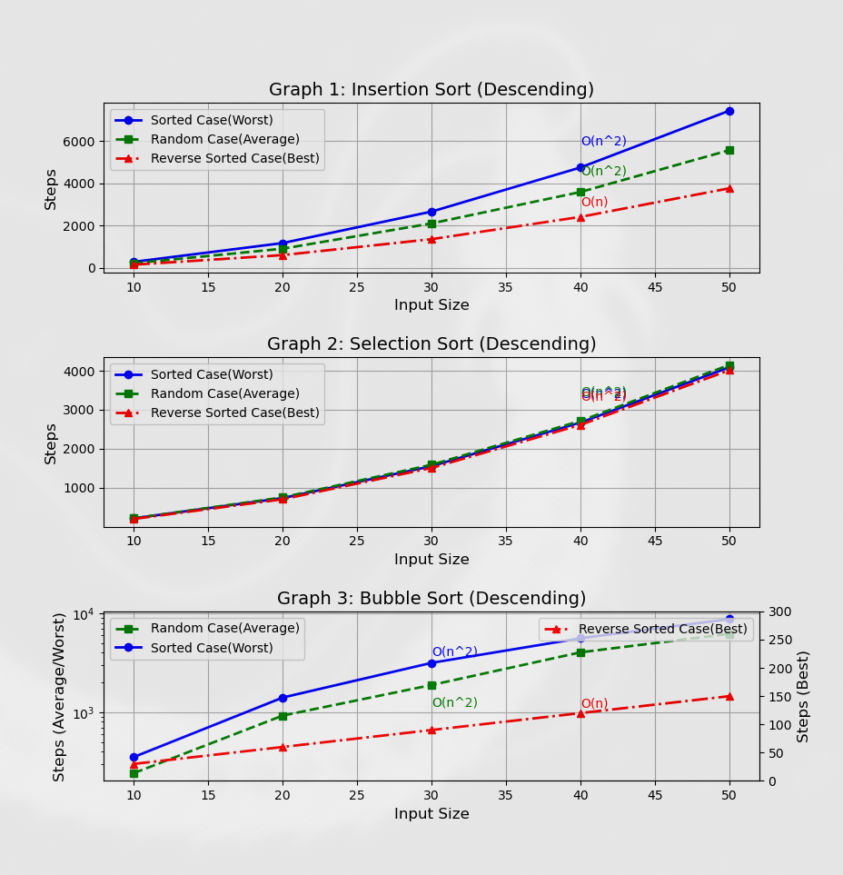

# Sorting Algorithms Analysis

Here, I have analysed **Selection Sort**, **Bubble Sort** and **Insertion Sort** algorithms with the **_Step Counting method_** and then plotted the results for different _input size_ vs _steps counted_ in graphs for both _ascending_ and _descending_ order sorting.

## How to run on your machine

- To run the source code, you will need the **rust compiler** and **cargo** utility installed and set up on your machine.
  You can install it using the appropriate package managers or curl if you are using _linux_ or _MacOS_ or you can download the setup executable. Visit https://doc.rust-lang.org/cargo/getting-started/installation.html for more info about installation.

- You will also need to have **python** installed and setup on your machine to run the python script to visualise the graphs.
  To get python, either use a package manager or check out
  https://python.org/downloads/ for installation.

- You also need matplotlib to visualise the graphs. You can get it by just running `pip install matplotlib` in your terminal for a global matplotlib install or you can set up a virtual environment and then install it. You can also use any other system package manager to install matplotlib in case your machine uses any other global package manager to keep things in sync.

- Run `cargo run` in the project directory and you will get the analysis. Then to test on a custom array, press _y_ and then enter the number of items you want in array and then type the array elements separated by spaces and press enter. You will get your full analysis.

- To get the graphs, run `python sorting_graph.py`.

## Screenshots

- ###Output example :
   
- ###Graphs :
  
  
